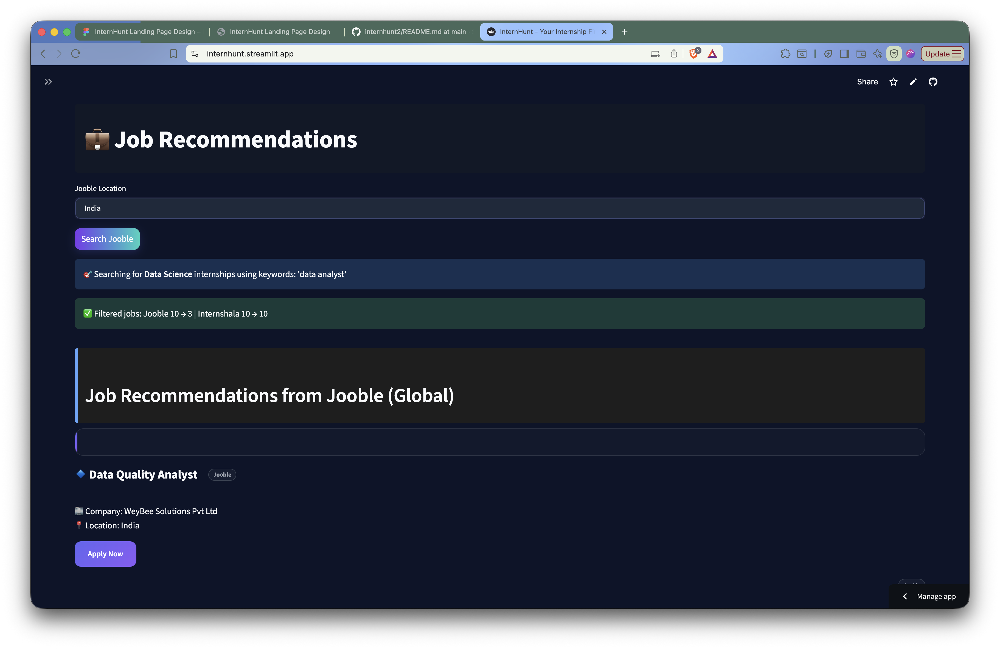

<div align="center">

# 🎯 InternHunt

### AI-Powered Internship Matching Platform

[](https://www.python.org/)
[](https://streamlit.io/)
[](https://ai.google.dev/)
[](https://scikit-learn.org/)

**Intelligent Internship Matching Using ML, APIs & Web Data**

[Features](#-features) • [Demo](#-demo) • [Installation](#-installation) • [Usage](#-usage) • [Tech Stack](#-tech-stack) • [Contributing](#-contributing)

</div>

---

## 📸 Demo

> **Add your screenshots here!**

### 🏠 Landing Page

*Beautiful hero section with animated scroll indicator*

### 💼 Resume Analysis

*Smart resume parsing and classification*

### 🤖 AI Career Assistant

*Powered by Google Gemini for personalized career guidance*

### 🎓 Course Recommendations

*Tailored learning paths based on your profile*

### 🔍 Job Search

*Real-time internship opportunities from multiple sources*

---

## ✨ Features

### 🎯 **Smart Resume Analysis**
- 📄 **Multi-format Support** - Upload PDF or DOCX resumes
- 🤖 **ML Classification** - Automatic role categorization using scikit-learn
- 📊 **Skill Extraction** - NLP-powered skill identification
- 💡 **Career Insights** - Get personalized recommendations

### 🤝 **AI Career Assistant**
- 💬 **Conversational AI** - Powered by Google Gemini
- 🎓 **Career Guidance** - Expert advice on internships and career paths
- 📚 **Context-Aware** - Remembers your resume and preferences
- ⚡ **Real-time Responses** - Fast and accurate answers

### 🔍 **Intelligent Job Matching**
- 🌐 **Multi-source Scraping** - Internshala, LinkedIn, and more
- 🎯 **Personalized Results** - Based on your skills and interests
- 📍 **Location-based** - Filter by city and remote options
- 🔄 **Real-time Updates** - Fresh opportunities daily

### 📚 **Course Recommendations**
- 🎓 **Skill-based Suggestions** - Courses aligned with your career goals
- 🏆 **Top Platforms** - Coursera, Udemy, edX, and more
- 📈 **Learning Paths** - Structured roadmaps for skill development
- ⭐ **Quality Curated** - Only the best courses recommended

### 🎨 **Modern UI/UX**
- 🌙 **Dark Theme** - Easy on the eyes
- ✨ **Glassmorphism** - Modern design aesthetics
- 📱 **Responsive** - Works on all devices
- 🎭 **Smooth Animations** - Delightful user experience

---

## 🚀 Quick Start

### Prerequisites

- Python 3.9 or higher
- pip package manager
- Google Gemini API key ([Get one here](https://ai.google.dev/))

### Installation

1. **Clone the repository**
```bash
git clone https://github.com/yourusername/internhunt2.git
cd internhunt2
```

2. **Create virtual environment**
```bash
python -m venv venv

# On Windows
venv\Scripts\activate

# On macOS/Linux
source venv/bin/activate
```

3. **Install dependencies**
```bash
pip install -r requirements.txt
```

4. **Download NLTK data** (Required for NLP)
```bash
python -c "import nltk; nltk.download('punkt'); nltk.download('stopwords')"
```

5. **Set up environment variables**
```bash
# Copy the example file
cp .env.example .env

# Edit .env and add your API keys
# GEMINI_API_KEY=your_api_key_here
# GEMINI_MODEL=gemini-1.5-flash
```

6. **Run the application**
```bash
streamlit run App.py
```

The app will open in your browser at `http://localhost:8501` 🎉

---

## 🔧 Configuration

### Environment Variables

Create a `.env` file in the root directory:

```env
# Google Gemini API
GEMINI_API_KEY=your_gemini_api_key_here
GEMINI_MODEL=gemini-1.5-flash

# Optional: Database Configuration
DB_HOST=localhost
DB_USER=root
DB_PASSWORD=your_password
DB_NAME=internhunt
```

### Streamlit Secrets (For Deployment)

For Streamlit Cloud deployment, add secrets in the dashboard:

```toml
# .streamlit/secrets.toml
GEMINI_API_KEY = "your_api_key_here"
GEMINI_MODEL = "gemini-1.5-flash"
```

---

## 🛠️ Tech Stack

### **Frontend**
-  **Streamlit** - Web framework
-  **HTML/CSS** - Custom styling
-  **JavaScript** - Interactive elements

### **Backend & ML**
-  **Python 3.9+** - Core language
-  **scikit-learn** - ML classification
-  **PyTorch** - Deep learning
-  **NLTK** - Natural language processing

### **AI & APIs**
-  **Google Gemini** - Conversational AI
-  **BeautifulSoup** - Web scraping
-  **Requests** - HTTP library

### **Data Processing**
-  **Pandas** - Data manipulation
-  **NumPy** - Numerical computing
- **PyPDF2 & python-docx** - Document parsing

---

## 📁 Project Structure

```
internhunt2/
├── 📄 App.py                      # Main application entry point
├── 🎨 styles.py                   # UI styling and themes
├── 🤖 chat_service.py             # Gemini AI chatbot logic
├── 📝 resume_parser.py            # Resume parsing & analysis
├── ⚙️ config.py                   # Configuration management
├── 🛠️ utils.py                    # Utility functions
├── 💾 database.py                 # Database operations
├── 🌐 api_services.py             # External API integrations
├── 🔍 job_scrapers.py             # Job scraping modules
├── ⚠️ error_handler.py            # Error handling
├── 📚 Courses.py                  # Course recommendation logic
├── 🤖 resume_classifier_v2.pkl    # Trained ML model
├── 📊 UpdatedResumeDataSet.csv    # Training dataset
├── 📋 requirements.txt            # Python dependencies
├── 📖 README.md                   # This file
├── 🔐 .env.example                # Environment variables template
├── 🚫 .gitignore                  # Git ignore rules
├── 📁 .streamlit/                 # Streamlit configuration
│   ├── config.toml
│   └── secrets.toml.example
├── 🔤 nevera_font/                # Custom fonts
├── 📂 Uploaded_Resumes/           # User uploaded resumes
└── 📄 pages/                      # Additional Streamlit pages
```

---

## 🎯 Usage Guide

### 1️⃣ **Upload Your Resume**
- Click on the file uploader
- Select your PDF or DOCX resume
- Wait for automatic analysis

### 2️⃣ **Explore Recommendations**
- View your classified role
- Check extracted skills
- Browse personalized job matches

### 3️⃣ **Chat with AI Assistant**
- Ask career-related questions
- Get interview tips
- Receive personalized advice

### 4️⃣ **Discover Courses**
- Browse recommended courses
- Filter by platform and topic
- Start learning!

### 5️⃣ **Search for Internships**
- Use filters (location, role, etc.)
- View detailed job descriptions
- Apply directly through links

---

## 🤝 Contributing

Contributions are welcome! Here's how you can help:

1. **Fork the repository**
2. **Create a feature branch**
   ```bash
   git checkout -b feature/AmazingFeature
   ```
3. **Commit your changes**
   ```bash
   git commit -m 'Add some AmazingFeature'
   ```
4. **Push to the branch**
   ```bash
   git push origin feature/AmazingFeature
   ```
5. **Open a Pull Request**

### Development Guidelines
- Follow PEP 8 style guide
- Add docstrings to functions
- Test your changes thoroughly
- Update documentation as needed

---

## 📝 License

This project is licensed under the MIT License - see the [LICENSE](LICENSE) file for details.

---

## 👨‍💻 Author

**Shubham Sharma**

- GitHub: [@ShubhamSnSharma](https://github.com/ShubhamSnSharma)
- LinkedIn: [Your LinkedIn](https://linkedin.com/in/yourprofile)
- Email: your.email@example.com

---

## 🙏 Acknowledgments

- [Google Gemini](https://ai.google.dev/) for the amazing AI capabilities
- [Streamlit](https://streamlit.io/) for the fantastic web framework
- [Internshala](https://internshala.com/) for internship data
- All open-source contributors

---

## 📊 Stats


---

<div align="center">

### ⭐ Star this repo if you find it helpful!

Made with ❤️ by Shubham Sharma

</div>
